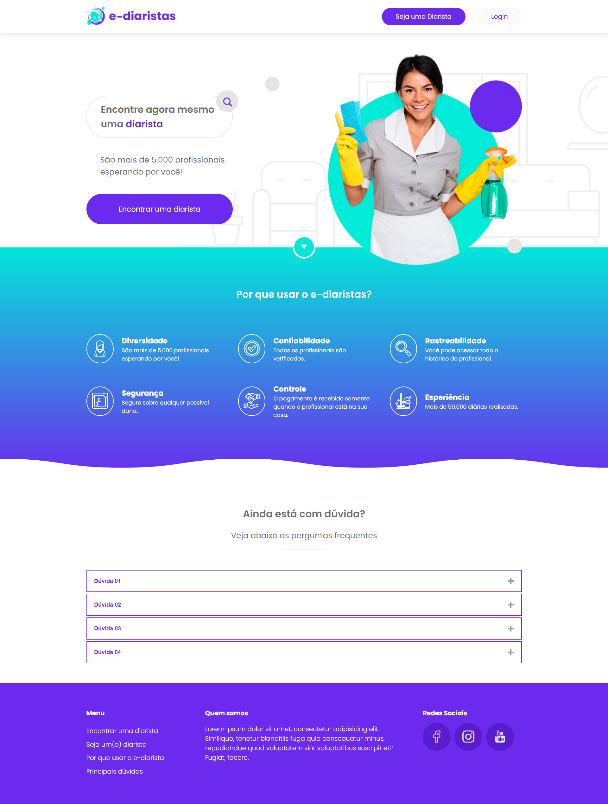

<h2> e-diaristas: startup de contratação de serviços </h2>
<h3>HTML, CSS e JavaScript</h3>

  

Este é o código-fonte da Landing Page "e-diaristas", desenvolvido durante o projeto prático da Treinaweb. 

<h3>Tecnologias utilizadas:</h3>

<ul>
  <li>HTML</li>
  <li>CSS</li>
  <li>Javascript</li>
</ul>

<h3> Acesse o projeto: </h3>
<a href="https://taoliveira.com.br/e-diaristas-html-css-js-treinaweb/"> Ver Projeto</a> 

<h3>Aprendizados:</h3>

Este projeto me permitiu solidificar meus conhecimentos em:

<ul>
  <li>Desenvolvimento web com HTML, CSS e Javascript;</li>
  <li>Responsividade para diferentes tamanhos de tela;</li>
  <li>Uso de Flexbox;</li>
  <li>Uso de Display Grid;</li>
  <li>Propriedades e seletores CSS;</li>
  <li>Criar componente de Accordion;</li>
  <li>Utilização de variáveis CSS;</li>
  <li>Trabalhar com pseudo-classes e pseudo elementos;</li>
</ul>

Fique à vontade para explorar o código e me contatar caso tenha alguma dúvida ou sugestão! 😊
